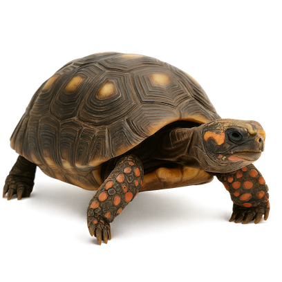
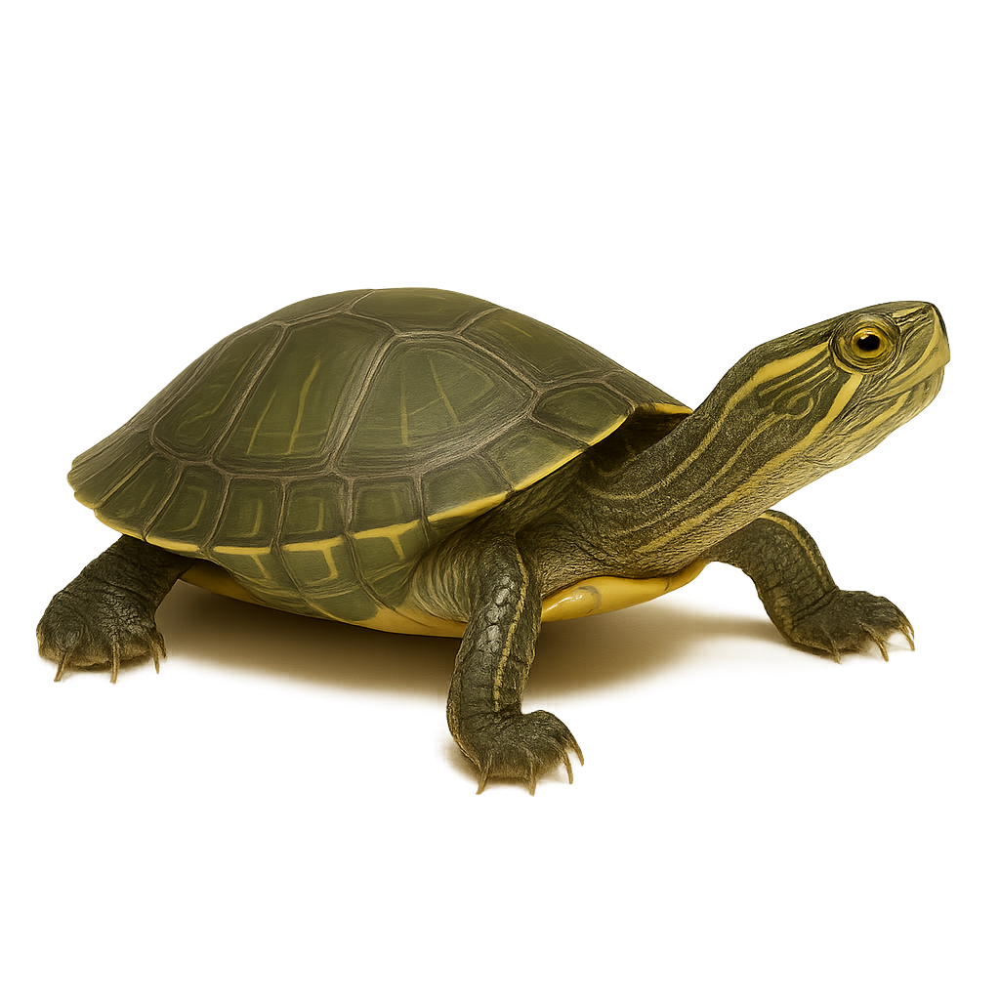
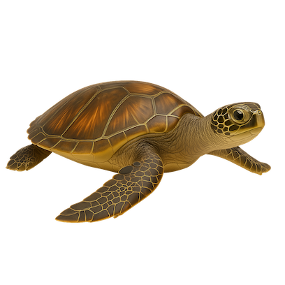

---
title:
keywords: homepage, index
hide_sidebar: true
permalink: index.html
toc: false
complex_map: true
map_name: usermapcomplex-M
box_number: 1
---
<h1 class="titulo-testudinia">TESTUDINIA</h1>





  

    

      <h2 class="page-header">Descubre las especies</h2>
    

    

      

        

          

            

              
            

            

              <h3>Tortugas terrestres</h3>
              <button type="button" class="btn btn-primary" data-toggle="modal" data-target="#myModal_Testudines">Explora</button>
            

          

        

        

          

            

              
            

            

              <h3>Tortugas de agua dulce</h3>
              <button type="button" class="btn btn-primary" data-toggle="modal" data-target="#myModal_Sauria">Explora</button>
            

          

        

        

          

            

              
            

            

              <h3>Tortugas marinas</h3>
              <button type="button" class="btn btn-primary" data-toggle="modal" data-target="#myModal_Serpentes">Explora</button>
            

          

        

      

    

  

